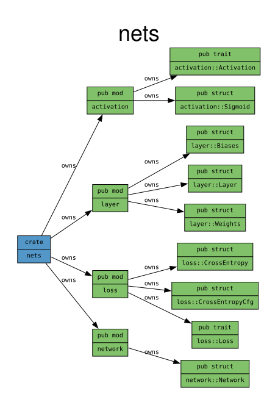

# Nets

This project is meant to implement neural networks in rust and provide
python bindings alongside.



# Development

For development, the precommit hooks need to be setup with:

```bash
git config core.hooksPath $PWD/hooks
```


